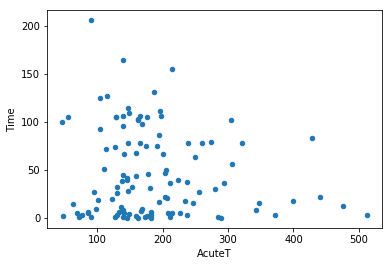
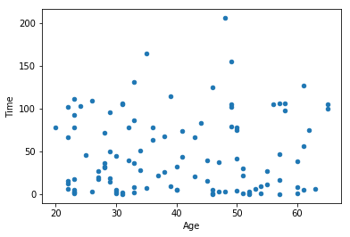
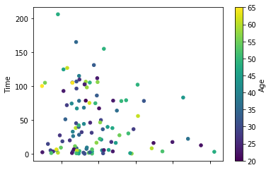
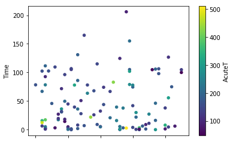
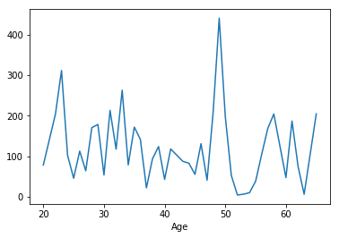
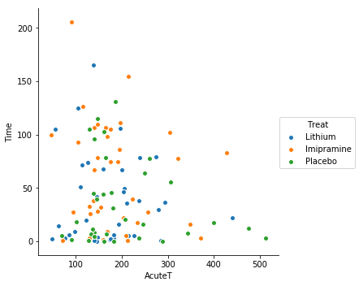
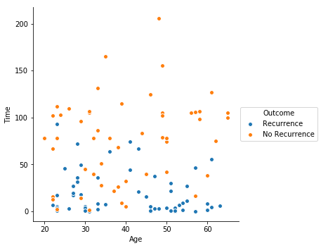
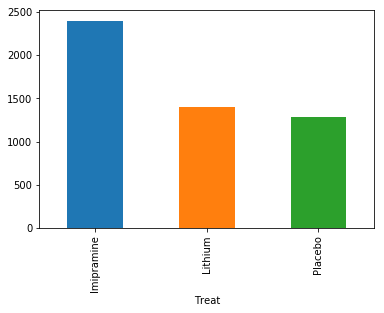
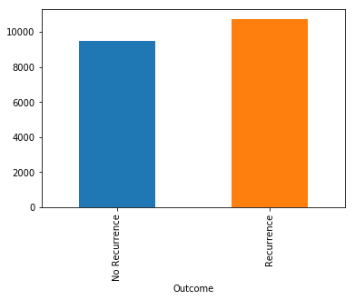
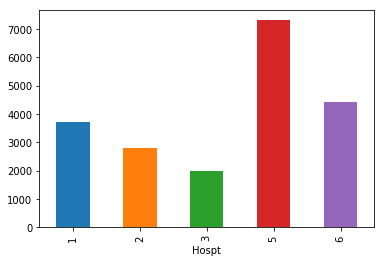

```python
import numpy as np
import pandas as pd
import seaborn as sns

from sklearn.ensemble import RandomForestClassifier
np.random.seed(0)
```


```python
# Load data
df = pd.read_excel('data/depression.xls')
print(len(df))
df.head()
```

    109


<div>
<style scoped>
    .dataframe tbody tr th:only-of-type {
        vertical-align: middle;
    }

    .dataframe tbody tr th {
        vertical-align: top;
    }

    .dataframe thead th {
        text-align: right;
    }
</style>
<table border="1" class="dataframe">
  <thead>
    <tr style="text-align: right;">
      <th></th>
      <th>Hospt</th>
      <th>Treat</th>
      <th>Outcome</th>
      <th>Time</th>
      <th>AcuteT</th>
      <th>Age</th>
      <th>Gender</th>
    </tr>
  </thead>
  <tbody>
    <tr>
      <th>0</th>
      <td>1</td>
      <td>Lithium</td>
      <td>Recurrence</td>
      <td>36.143</td>
      <td>211</td>
      <td>33</td>
      <td>1</td>
    </tr>
    <tr>
      <th>1</th>
      <td>1</td>
      <td>Imipramine</td>
      <td>No Recurrence</td>
      <td>105.143</td>
      <td>176</td>
      <td>49</td>
      <td>1</td>
    </tr>
    <tr>
      <th>2</th>
      <td>1</td>
      <td>Imipramine</td>
      <td>No Recurrence</td>
      <td>74.571</td>
      <td>191</td>
      <td>50</td>
      <td>1</td>
    </tr>
    <tr>
      <th>3</th>
      <td>1</td>
      <td>Lithium</td>
      <td>Recurrence</td>
      <td>49.714</td>
      <td>206</td>
      <td>29</td>
      <td>2</td>
    </tr>
    <tr>
      <th>4</th>
      <td>1</td>
      <td>Lithium</td>
      <td>No Recurrence</td>
      <td>14.429</td>
      <td>63</td>
      <td>29</td>
      <td>1</td>
    </tr>
  </tbody>
</table>
</div>


```python
# Assign numerical values to treatments
df['treat_id'], _ = pd.factorize(df['Treat'])

# Randomly assign training/testing sets
df['is_train'] = np.random.uniform(0, 1, len(df)) <= .75
train, test = df[df['is_train']==True], df[df['is_train']==False]
print('Training data:', len(train))
print('Testing data:', len(test))

# Choose features for building model
features = ['Hospt', 'treat_id', 'Time', 'AcuteT', 'Age', 'Gender']
# features = ['treat_id', 'Age', 'Gender']
y, _ = pd.factorize(train['Outcome'])

# Dict for converting factorized vals back to words
oc = dict()
oc['0'], oc['1'] = 'Recurrence', 'No Recurrence'

# Create + train a random forest classifier
clf = RandomForestClassifier(n_jobs=2, random_state=0)
clf = clf.fit(train[features], y)
clf
```

    Training data: 88
    Testing data: 21


    RandomForestClassifier(bootstrap=True, class_weight=None, criterion='gini',
                max_depth=None, max_features='auto', max_leaf_nodes=None,
                min_impurity_decrease=0.0, min_impurity_split=None,
                min_samples_leaf=1, min_samples_split=2,
                min_weight_fraction_leaf=0.0, n_estimators=10, n_jobs=2,
                oob_score=False, random_state=0, verbose=0, warm_start=False)


```python
# Predicted probabilities of first 10 observations
clf.predict_proba(test[features])[0:10]
```


    array([[0.6, 0.4],
           [0.1, 0.9],
           [0. , 1. ],
           [0.9, 0.1],
           [0.9, 0.1],
           [1. , 0. ],
           [0.3, 0.7],
           [0.1, 0.9],
           [0.8, 0.2],
           [0.1, 0.9]])


```python
# Apply classifier to test data
preds = clf.predict(test[features])
preds = [oc[str(x)] for x in preds]

# Create confusion matrix
test_result = pd.crosstab(np.array(test['Outcome']), np.array(preds),
                          rownames= ['Actual'], colnames=['Predicted'])
test_result
```


<div>
<style scoped>
    .dataframe tbody tr th:only-of-type {
        vertical-align: middle;
    }

    .dataframe tbody tr th {
        vertical-align: top;
    }

    .dataframe thead th {
        text-align: right;
    }
</style>
<table border="1" class="dataframe">
  <thead>
    <tr style="text-align: right;">
      <th>Predicted</th>
      <th>No Recurrence</th>
      <th>Recurrence</th>
    </tr>
    <tr>
      <th>Actual</th>
      <th></th>
      <th></th>
    </tr>
  </thead>
  <tbody>
    <tr>
      <th>No Recurrence</th>
      <td>7</td>
      <td>3</td>
    </tr>
    <tr>
      <th>Recurrence</th>
      <td>2</td>
      <td>9</td>
    </tr>
  </tbody>
</table>
</div>


```python
# View importance scores of features
for i, score in enumerate(list(clf.feature_importances_)):
    print(round(100*score, 1), features[i])
```

    8.8 Hospt
    6.4 treat_id
    51.4 Time
    16.9 AcuteT
    14.1 Age
    2.4 Gender


```python
df.plot.scatter(x='AcuteT', y='Time')
```


    <matplotlib.axes._subplots.AxesSubplot at 0x1a1e7fb358>





```python
df.plot.scatter(x='Age', y='Time')
```


    <matplotlib.axes._subplots.AxesSubplot at 0x1a1e2f0048>





```python
df.plot.scatter('AcuteT', 'Time', c='Age', colormap='viridis')
```


    <matplotlib.axes._subplots.AxesSubplot at 0x1a1e82df98>





```python
df.plot.scatter(x='Age', y='Time', c='AcuteT', colormap='viridis')
```


    <matplotlib.axes._subplots.AxesSubplot at 0x1a1e957438>





```python
df.groupby('Age')['Time'].sum().plot()
```


    <matplotlib.axes._subplots.AxesSubplot at 0x1a1e9cfd30>





```python
sns.pairplot(x_vars=["AcuteT"], y_vars=["Time"], data=df, hue="Treat", size=5)
```


    <seaborn.axisgrid.PairGrid at 0x1a1eadde10>





```python
sns.pairplot(x_vars=["Age"], y_vars=["Time"], data=df, hue="Outcome", size=5)
```


    <seaborn.axisgrid.PairGrid at 0x1a1f01c7b8>





```python
df.groupby('Treat')['Time'].sum().plot.bar()
```


    <matplotlib.axes._subplots.AxesSubplot at 0x1a1ec4a630>





```python
df.groupby('Outcome')['AcuteT'].sum().plot.bar()
```


    <matplotlib.axes._subplots.AxesSubplot at 0x1a1e9ec710>





```python
df.groupby('Hospt')['AcuteT'].sum().plot.bar()
```


    <matplotlib.axes._subplots.AxesSubplot at 0x1a1ede8160>




